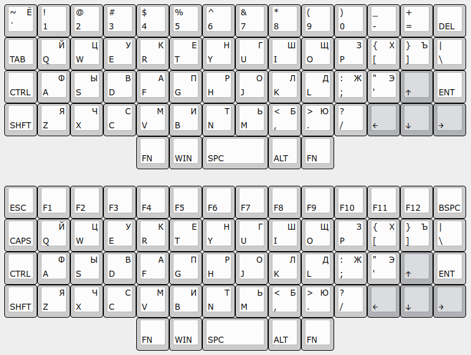
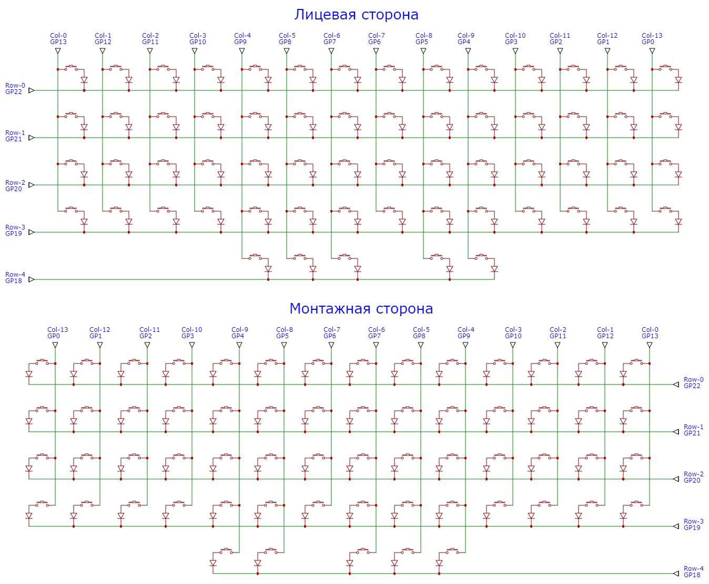
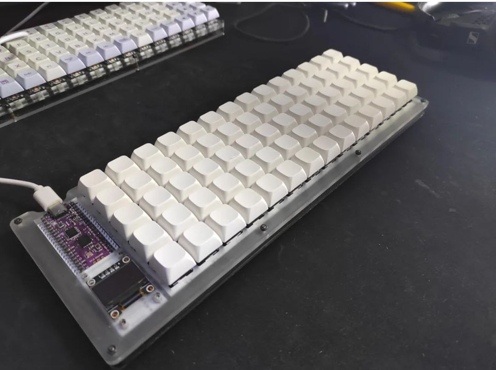
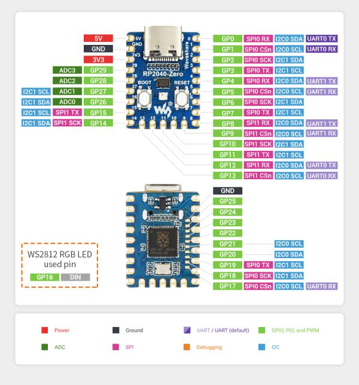

Раскладка

Схема

Варианты монтажа в корпусе

Прототип

PRK Firmware:
- [PRK Firmware](https://github.com/picoruby/prk_firmware)
- [PRK Documentation](https://github.com/picoruby/prk_firmware/wiki/Tutorial)

Microcontroller:
- [RP2040-Zero](https://www.waveshare.com/rp2040-zero.htm)

### Доп.инфо

Руководства:
- [DIY клавиатура из фанеры](https://habr.com/ru/articles/795727/)
- [Какие бывают переключатели](https://geekboards.ru/page/mechanical_switches_v2)
- [Keycap Profile & Size Information](https://blog.maxkeyboard.com/dwkb/keycap-profile-size-information/)
- [Руководство Plate Builder](http://builder-docs.swillkb.com/features/#switch-type)

Видео:
- [DIY Macropad](https://www.youtube.com/watch?v=BcXycScePHM)
- [Designing a handwired macropad for live streaming](https://www.youtube.com/watch?v=cI2fcIEEh_A)
- [How to Design Mechanical Keyboard Plates and Cases](https://www.youtube.com/watch?v=7azQkSu0m_U)
- [Building the ScottoAlp Handwired Mechanical Keyboard Part 1](https://www.youtube.com/watch?v=gVn9Gcfyt1Y)
- [Building the ScottoAlp Handwired Mechanical Keyboard Part 2](https://www.youtube.com/watch?v=fNw5EELwTT0)

Софт для 3D моделирования:
- [https://www.shapr3d.com/](https://www.shapr3d.com/)
